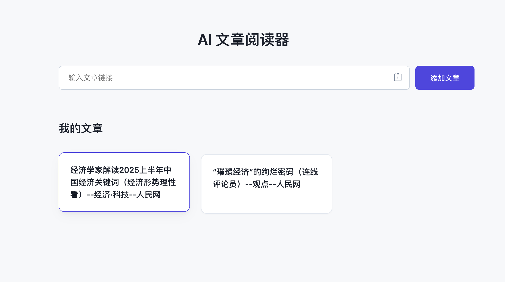
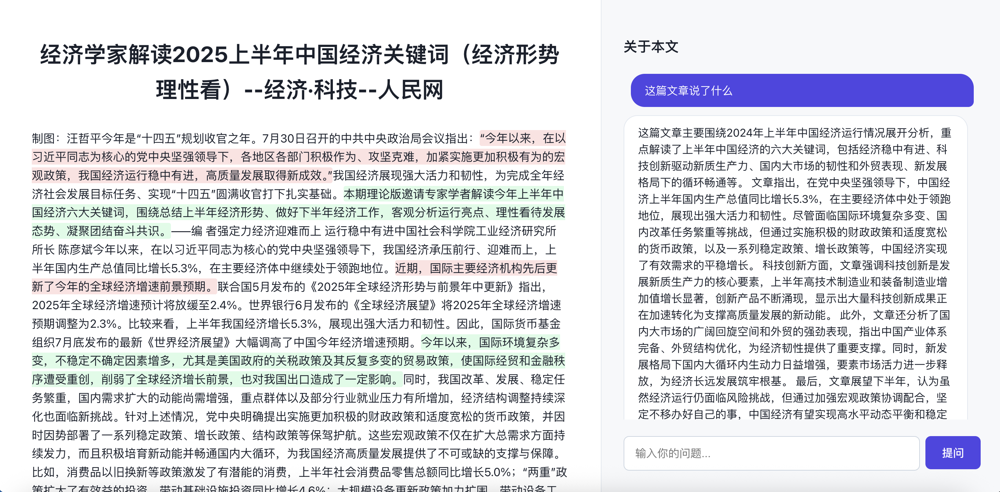

# AI 文章阅读器

AI 文章阅读器是一个全栈Web应用，允许用户输入文章链接，应用会自动抓取、解析和美化文章内容，并利用大语言模型（LLM）提供智能问答功能。

## ✨ 功能特性

- **文章抓取与解析**: 输入任意文章链接，自动提取正文内容。
- **AI内容美化**: 使用AI对抓取的内容进行润色、格式化，并高亮关键句子。
- **智能问答**: 针对文章内容，向AI进行提问并获得解答。
- **持久化存储**: 文章数据使用 SQLite 数据库进行持久化存储。
- **现代化UI**: 采用 React 和 Vite 构建的现代化、响应式前端界面。
- **前后端分离**: 基于 Flask (后端) 和 React (前端) 的分离式架构。

## 📸 应用截图

- 主界面



- 文章阅读界面



## 🛠️ 技术栈

- **后端**:
  
    - Python
    - Flask
    - Newspaper3k (文章抓取)
    - OpenAI API (AI能力)
    - SQLite (数据库)
    - `uv` (包管理)
- **前端**:
    - React
    - Vite
    - React Router
    - CSS (自定义样式与变量)

## 🚀 快速开始

### 环境准备

- [Node.js](https://nodejs.org/) (v18 或更高版本)
- [Python](https://www.python.org/) (v3.9 或更高版本)
- [uv](https://github.com/astral-sh/uv) (Python 包管理器)

---

### 后端安装与运行

1.  **进入后端目录**
    ```bash
    cd back
    ```

2.  **创建并激活虚拟环境**
    ```bash
    # 创建虚拟环境
    uv venv
    # 激活虚拟环境 (macOS/Linux)
    source .venv/bin/activate
    # 激活虚拟环境 (Windows)
    .venv\Scripts\activate
    ```

3.  **安装依赖**
    ```bash
    uv sync
    ```

4.  **配置环境变量**
    在 `back` 目录下创建一个名为 `.env` 的文件，并填入您的 OpenAI API 密钥和基础URL：
    ```env
    OPENAI_API_KEY="sk-your-key"
    OPENAI_API_BASE="https://api.openai.com/v1"
    FLASK_DEBUG=true
    ```

5.  **运行后端服务**
    ```bash
    uv run
    ```
    后端服务将在 `http://127.0.0.1:4000` 上运行。

---

### 前端安装与运行

1.  **进入前端目录**
    在一个**新的终端**中，进入 `front` 目录：
    ```bash
    cd front
    ```

2.  **安装依赖**
    ```bash
    npm install
    ```

3.  **运行前端开发服务器**
    ```bash
    npm run dev
    ```
    前端应用将在 `http://127.0.0.1:5173` (或另一个可用端口) 上运行，并已配置好代理，会自动将 `/api` 请求转发到后端。

## 目录结构

```
.
├── back/         # 后端 (Flask)
│   ├── database.py
│   ├── main.py
│   ├── model.py
│   ├── pyproject.toml
│   └── ...
└── front/        # 前端 (React)
    ├── public/
    ├── src/
    ├── package.json
    └── vite.config.js
```
